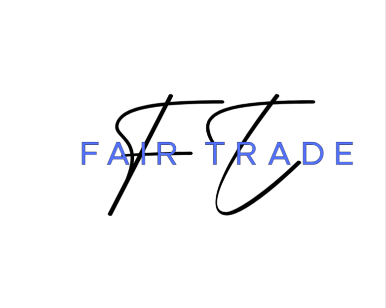

    

# FairTrade – Secure Informal Trade Infrastructure
## Project Overview

FairTrade is a C2C (Consumer-to-Consumer) e-commerce marketplace designed to provide secure and structured digital infrastructure for informal traders in South Africa.

The platform bridges the gap between informal trade and formal e-commerce systems by providing:

- Identity verification for sellers

- Escrow-based payment processing

- Courier-based delivery confirmation

- Seller compliance monitoring

- Product moderation before listing

- Structured dispute resolution

## Core Objectives

- Enable secure C2C transactions

- Reduce fraud in informal trade

- Lower entry barriers for small sellers

- Provide structured digital trust mechanisms

- Support sustainable informal entrepreneurship

## Technology Stack

### Frontend:

- HTML

- Bootstrap

- CSS

- JavaScript

### Backend:

- Laravel (PHP Framework)

- MySQL Database

### Version Control:

Git + GitHub

## System Interfaces

The platform consists of three primary interfaces:

1. Buyer Interface

2. Seller Interface (with Store Management)

3. Admin Interface (Moderation & Compliance)

## Status

Project Phase: Initial Infrastructure Setup

